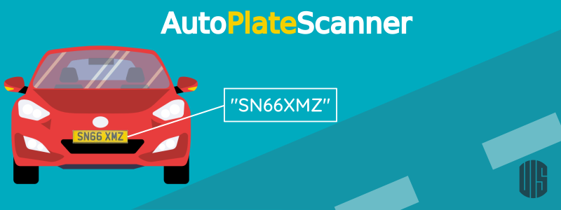

# AutoPlateScanner

## Autores
José Silva, Daniel Gonzalez, Jean Rodriguez

## Objetivo
El objetivo de este proyecto es segmentar placas vehiculares y obtener sus caracteres.

## Dataset
El dataset de Kaggle se puede obtener de [aquí](https://www.kaggle.com/datasets/andrewmvd/car-plate-detection).

## Modelos
Red neuronal convolucional, Mapa de contornos, Data Augmentation

## Enlaces
- [Dataset](https://drive.google.com/drive/folders/11muMlJMB6GYkmE2CGisGGKUgEAOsi5LI?usp=drive_link)
- [Vídeo](https://youtu.be/6x-K7wK9q2c)
